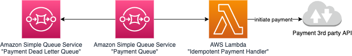

# Lambda Power Tools for Java - Idempotency Module - Amazon SQS
This project contains source code and supporting files for a serverless application that you can deploy with SAM CLI. 
The application uses AWS Power Tools for Java to implement a lambda function that processes records from Amazon SQS queue in an idempotent way using AWS Lambda Power Tools Idempotency module.
For more information on the module, refer to the [documentation](https://awslabs.github.io/aws-lambda-powertools-java/utilities/idempotency/)

The project contains following files and directories:

- src/main/java - Code for the application's Lambda function.
- src/main/test - Unit tests.
- template.yaml - A template that defines the application's AWS resources.

The application uses several AWS resources, including Amazon DynamoDB table, SQS queue and Lambda function. These resources are defined in the `template.yaml` file. You can update the template to add AWS resources through the same deployment process that updates your application code.

The application uses Dagger as a Dependency Injection Framework. For more information, refer to the [documentation](https://dagger.dev/)

## Architecture
The idempotent Lambda function reads payment messages from the SQS queue in a batch. The idempotency within the handler guarantees processing of the same payment request exactly once.
It includes both the cases of 'at-least-once' message delivery for the SQS Standard Queue and failures of the 3rd party API.

For the purpose of the example, a 3rd party Payment API has been replaced with a simple mock implementation: ``software.amazon.lambda.samples.powertools.idempotency.sqs.payment.api.FakePaymentApi``
The mock can simulate a service error by throwing an exception. Then the full batch of SQS messages will be retried by default.
The idempotency feature will guarantee that only unprocessed messages from the batch will be processed again.

You can take a look at the [SQS Batch Processing](https://awslabs.github.io/aws-lambda-powertools-java/utilities/batch/)  module of the AWS Lambda Power Tools to retry only the messages that failed processing instead of a full batch.



## Deploy the sample application

The Serverless Application Model Command Line Interface (SAM CLI) is an extension of the AWS CLI that adds functionality for building and testing Lambda applications. It uses Docker to run your functions in an Amazon Linux environment that matches Lambda. It can also emulate your application's build environment and API.

To use the SAM CLI, you need the following tools.

* SAM CLI - [Install the SAM CLI](https://docs.aws.amazon.com/serverless-application-model/latest/developerguide/serverless-sam-cli-install.html)
* Java11 - [Install the Java 11](https://docs.aws.amazon.com/corretto/latest/corretto-11-ug/downloads-list.html)
* Maven - [Install Maven](https://maven.apache.org/install.html)
* Docker - [Install Docker community edition](https://hub.docker.com/search/?type=edition&offering=community)

To build and deploy your application for the first time, run the following in your shell:

```bash
idempotency-sqs$ sam build
idempotency-sqs$ sam deploy --guided
```

The first command will build the source of your application. The second command will package and deploy your application to AWS, with a series of prompts:

* **Stack Name**: The name of the stack to deploy to CloudFormation. This should be unique to your account and region, and a good starting point would be something matching your project name.
* **AWS Region**: The AWS region you want to deploy your app to.
* **Confirm changes before deploy**: If set to yes, any change sets will be shown to you before execution for manual review. If set to no, the AWS SAM CLI will automatically deploy application changes.
* **Allow SAM CLI IAM role creation**: Many AWS SAM templates, including this example, create AWS IAM roles required for the AWS Lambda function(s) included to access AWS services. By default, these are scoped down to minimum required permissions. To deploy an AWS CloudFormation stack which creates or modified IAM roles, the `CAPABILITY_IAM` value for `capabilities` must be provided. If permission isn't provided through this prompt, to deploy this example you must explicitly pass `--capabilities CAPABILITY_IAM` to the `sam deploy` command.
* **Save arguments to samconfig.toml**: If set to yes, your choices will be saved to a configuration file inside the project, so that in the future you can just re-run `sam deploy` without parameters to deploy changes to your application.

You can find your SQS Queue URL in the output values displayed after deployment.

## Testing

Having the SQS URL, you can run the following command to send a sample message to the queue:

````bash
aws sqs send-message --queue-url  <your-sqs-url> --message-body '{
"orderId": "order1",
"userId": "user1",
"amount": "50.25"
}'
````

You should get a MessageId as a response. It means that the message was added to the SQS queue.
Processing of the message is handled by the lambda function that reads messages from the Queue and processes each SQS record in an idempotent way.
If you retry the call with the same message body the flow is going to be the same, although the SQS record will be not processed more than once(by default for 1 hour but the setting for it can be changed).
Thanks to the idempotency module the lambda will skip the record and will just return a paymentId as an output from the function. You can observe it by taking a look at the CloudWatch logs of the lambda function.

## Add a resource to your application
The application template uses AWS Serverless Application Model (AWS SAM) to define application resources. AWS SAM is an extension of AWS CloudFormation with a simpler syntax for configuring common serverless application resources such as functions, triggers, and APIs. For resources not included in [the SAM specification](https://github.com/awslabs/serverless-application-model/blob/master/versions/2016-10-31.md), you can use standard [AWS CloudFormation](https://docs.aws.amazon.com/AWSCloudFormation/latest/UserGuide/aws-template-resource-type-ref.html) resource types.

## Cleanup

To delete the sample application that you created, use the AWS CLI. Assuming you used your project name for the stack name, you can run the following:

```bash
aws cloudformation delete-stack --stack-name <Name-of-your-deployed-stack>
```

# Appendix

## Powertools

**Tracing**

[Tracing utility](https://awslabs.github.io/aws-lambda-powertools-java/core/tracing/) provides functionality to reduce the overhead of performing common tracing tasks. It traces the execution of this sample code including the response and exceptions as tracing metadata - You can visualize them in AWS X-Ray.

**Logger**

[Logging utility](https://awslabs.github.io/aws-lambda-powertools-java/core/logging/) creates an opinionated application Logger with structured logging as the output, dynamically samples a percentage (samplingRate) of your logs in DEBUG mode for concurrent invocations, log incoming events as your function is invoked, and injects key information from Lambda context object into your Logger - You can visualize them in Amazon CloudWatch Logs.

**Metrics**

[Metrics utility](https://awslabs.github.io/aws-lambda-powertools-java/core/metrics/) captures cold start metric of your Lambda invocation, and could add additional metrics to help you understand your application KPIs - You can visualize them in Amazon CloudWatch.

## Resources

See the [AWS SAM developer guide](https://docs.aws.amazon.com/serverless-application-model/latest/developerguide/what-is-sam.html) for an introduction to SAM specification, the SAM CLI, and serverless application concepts.

Check the [AWS Lambda Powertools Java](https://awslabs.github.io/aws-lambda-powertools-java/) for more information on how to use and configure such tools

Next, you can use AWS Serverless Application Repository to deploy ready to use Apps that go beyond simple examples and learn how authors developed their applications: [AWS Serverless Application Repository main page](https://aws.amazon.com/serverless/serverlessrepo/)